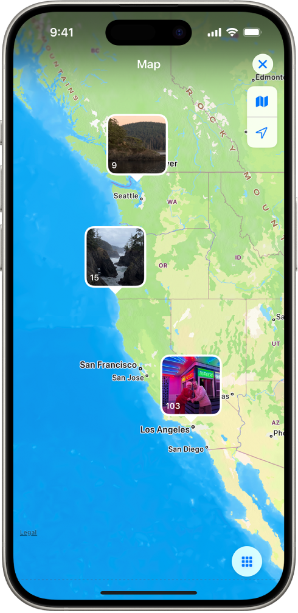
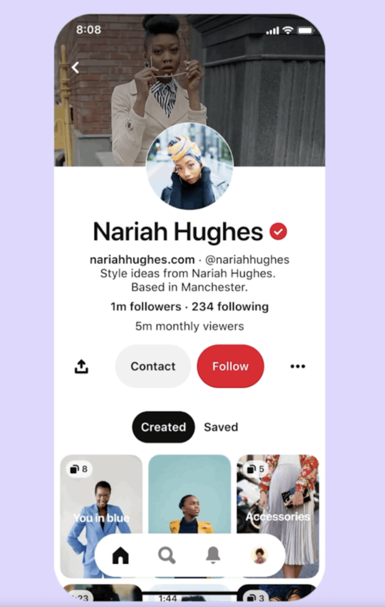
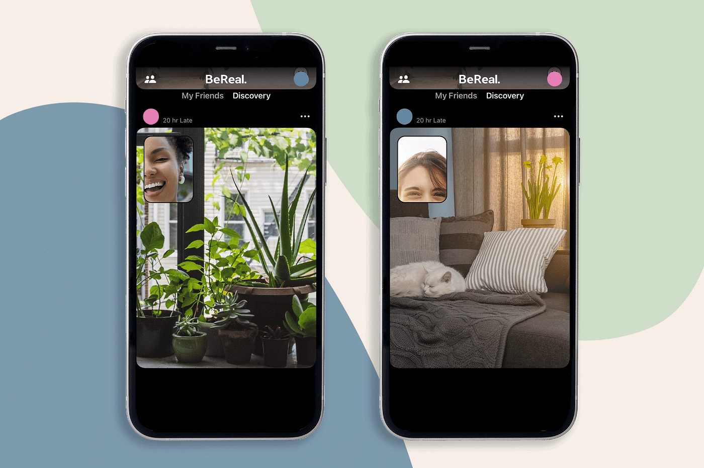
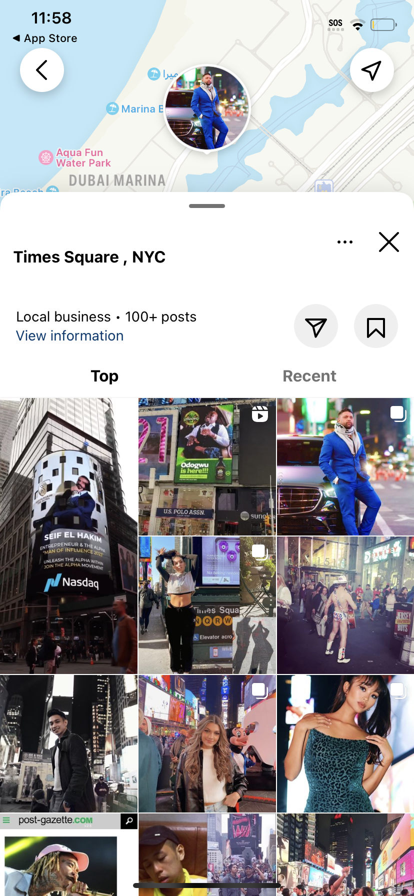
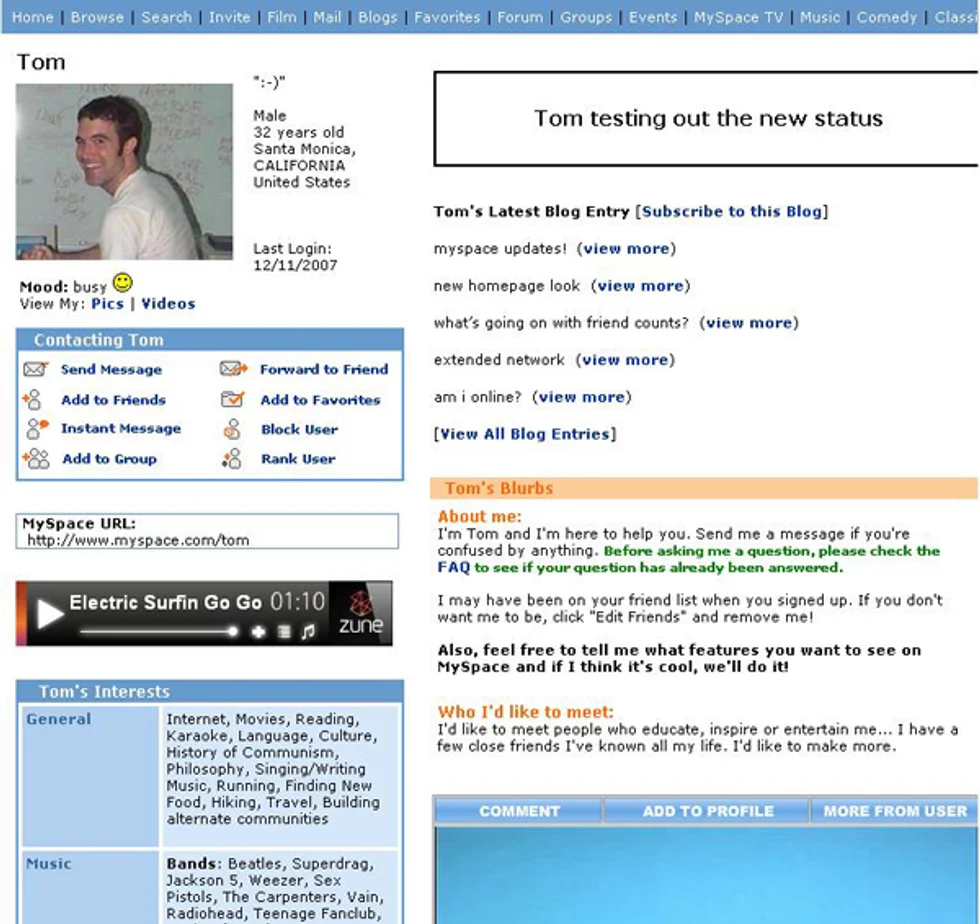
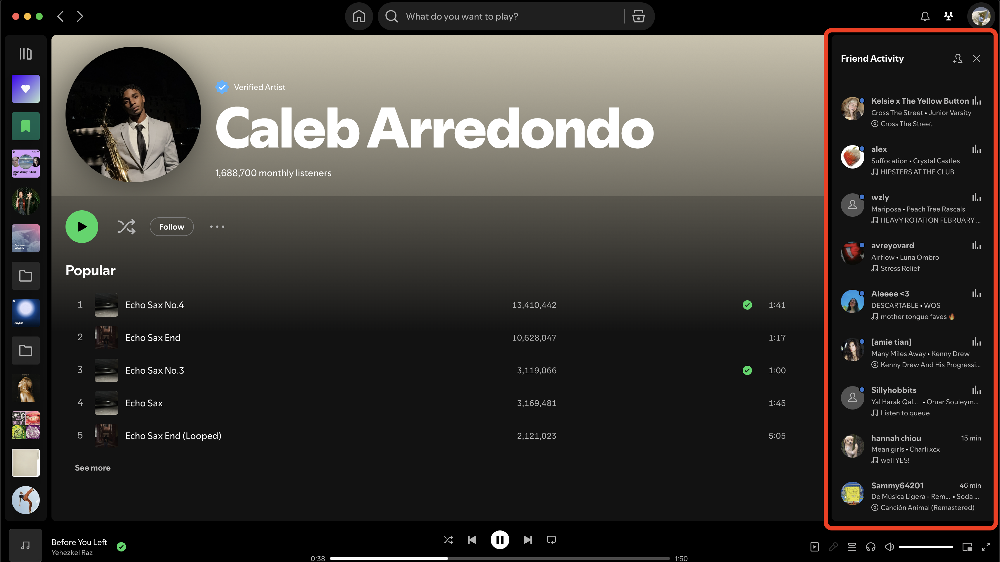
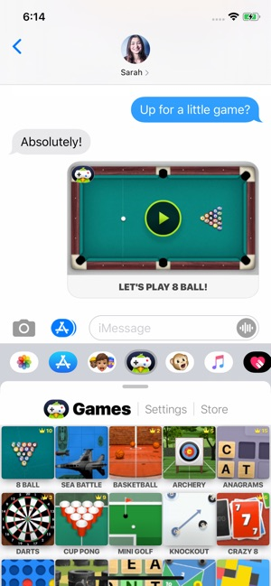

# Assignment 2

## Broad Application Goals: PocketMe

PocketMe is a thoughtful, intentional social media platform designed for deep reflections, poetry and journaling it tries to resemble the format used in handwritten letters and diaries, it also lets users also add images to it. It allows users to share unfiltered thoughts, emotions, and everyday moments with close friends, creating a private and personal space for meaningful connections and memories. Its main purpose is to not overwhelm users.

Target audience is elders who like to update their friends and family about what they have been up to, memories, poetry, or just day-today-occurences.

## Scrapbook of Comparables
- Apple’s feature to see where you have taken pictures: could give an option of adding a location your journal entries and could show a map of them if they had a location added to them. It groups them according to the location. 
{:width='200'}

- Pinterest profile page: could incorporate a similar order where if first shows the latest entries section, then it could show the lists that the user has to organize entries into different topics/ themes 
{:width='200'}

- 2 Feeds similar to Bereal: could divide the feeds in different categories based on the content they want inmediate access to.
{:width='500'}

- Instagrams page of other posts tagging the same location: could be useful to discover other people’s anecdotes or memories in the same space.
{:width='200'}

- Myspace songs/ spotify activity: Similarly the user can show in the profile their favorite song, a recently listened widget could also be added. It could also be something that shows live what they are listening to like their activity this is also similar to what Spotify pc app has.
{:width='400'}

{:width='500'}

- Game Pigeon: To help people stay connected and engage through something different than posts, classic word games could be implemented or games that historically used to be done with pen and paper, like sudoku.
{:width='200'}

## VSD analysis

### Stakeholders (identifying the people directly or indirectly impacted); 
* Currently my app targets elders who want to socialize and stay in touch with their family through sharing text based media. I believe that other people who might adopt it might be older Gen Z or Millennials as many people are trying to stay away from doomscrolling on social media and algorithms that try to feed them with personalized content. To keep the app minimal the feed where content is suggested could only be from mutual friends, instead of being based in the content they engage the most with (stickynote/bookmark).

* Variation in Human Ability: Since the app is centered around writing this might limit the participation of people who have different physical abilities related to sight touch or motor control. In this case since the app is centered around writing a way to expand the experience for people experiencing blindness could be through a text reader option that read out loud the text (when going through entries) or through voice to text abilities (for when they are creating their own entry) although some devices already incorporate this feature my application could attempt providing a more accurate one. 

* On the other hand I believe the app could be used in other scenarios besides personal journaling, it could also be used in educational environments for instance for courses that require students to keep a journal where they have to keep track of something overtime like growing a plant, or anecdotes that come up throughout a project.

### Time (thinking through short, medium, and long-term effects); 
* I believe my PocketMe would influence people to journal more maybe they might not stay in the app but might move on to physical journals, it might encourage people to write things down and actually revisit them. To further encourage writing I think I could implement a minimum letter count for people to submit an entry, which could result in people adding random characters just to use up the extra space to allow a post.

### Values (evaluating in terms of common values such as autonomy, community, inclusion and fairness)
 * In terms of values the app is centered in facilitating communication in communities of elders and ending isolation. This  app could allow them to meet more people online, communicate with other younger family members that can’t visit them often and build stronger connections with them.  The app simplicity avoids overstimulation often cause by numerous types of media/ features. To keep the app organized and allow users to have various types of interactions the app could allow them to choose which features they want to have or disable. 

## Features Brainstorm  
1. Collaborative journaling: Allow other users to edit the text or add pictures, useful when journaling about a trip together or a collective experience. 
2. Journals: Organize posts according to the type of entry, such as daily reflections, travel logs, or specific themes. 
3. Immediate friends feed: A feed showing the latest posts from people you have decided to follow, keeping you updated on their journaling activity.
4. Mutuals: A feature that highlights friends of friends who you might be interested in meeting or following, based on shared connections. 
5. Memories: Organizes reflections into a calendar view, where you can see the dates when they were submitted for easier reference and nostalgia. 
6. Bump: Pocketme sends journaling prompts or guiding questions to remind users to journal and reflect more frequently. 
7. Soundtrack: Users can attach a song to their profiles, which could be pulled through their latest music activity in an app like Spotify. 
8. Dice: Generates random prompts for users to write about, encouraging spontaneous writing and reflections on experiences. 
9. Bookmark: Allows users to save other people’s journal entries if it’s something they enjoyed and would like to revisit later. 
10. Inspired: Users can create a new post inspired by someone else’s journal entry, threading it to the original post with a small reference in case others want to read the source of inspiration. 
11. Minigames: Send short word game challenges to your friends, such as sudoku, anagrams, or crosswords, to encourage fun interactions. 
12. Yfact: Users are asked to share a brief fun fact or tip with others, often related to specific topics like health or creativity, fostering a sense of community knowledge-sharing. 
13. Greeting: Users can send a brief greeting or message to someone, either as a way to check in or share a positive note. 
14. Sticky Note: Comment on a specific section in a journal entry, leaving feedback or a personal reflection directly attached to the text. 
15. Map: Users can access past entries, with pins placed on a global map to group pictures or journal entries based on the locations where they were written. 
16. Doodle: Users can add pictures to their journal but also have the option to doodle or sketch ideas, better expressing their thoughts through creative visuals
17. Neighborhoods: Users can join neighborhoods dedicated to specific hobbies or interests, like gardening, where journal entries tagged with that hobby appear in a curated feed. 
18. Stamps: People can collect stamps as they reach certain milestones, like completing a number of entries or achieving specific user behaviors. Stamps can also be traded with others and displayed on user profiles. 
19. Mail: Users can send private messages to others, with the option for both instant messages and longer, journal-like correspondence. 
20. Flowers of appreciation: Users can send words of encouragement or appreciation to others, coupled with virtual flowers and postcards that feature detailed animations to brighten someone's day.

## Storyboarding and sketching
### Make a post
{:width='500'}

### Make a post
{:width='500'}

