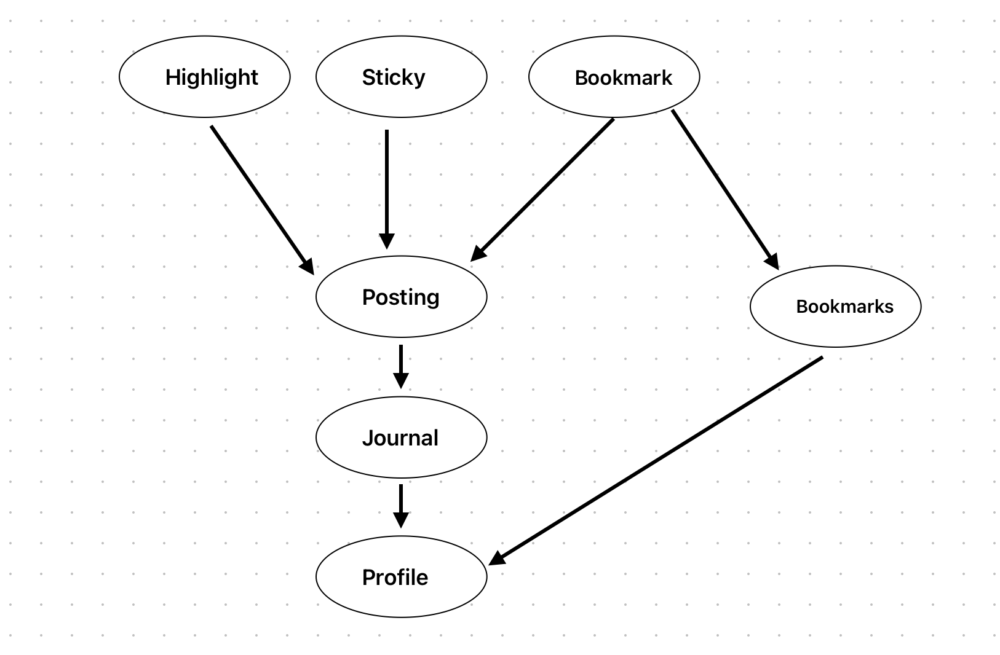

# Assignment 3

## Pitch

Users can create journals that allow them to post entries with text and images, which can be either public or private. Entries are tagged by topics like family, travel, food, or hobbies, making it easy to explore similar content. A highlight feature enables readers to comment directly on specific parts of other users' entries.

PocketMe’s unique "Places" feature lets users tag the location of their entries, adding an interactive map that showcases where memories were made. With options to save favorite posts to bookmarks. This app ensures a simple yet heartfelt way for elders to stay connected with family or friends and preserve their life stories and reflections.

## Functional Design 
### Concepts
- concept Posting [Item]
    - purpose: media entry 
    - principle: Users can create media to share for other users to see publicly or they can keep privately just for them to access.
    - state:
        - public: set Boolean
        - body: entry -> one content
	    - tags: multiple Strings
	    - LocationPin: Entry -> one map location
    - actions
	    - AddPost(i: item, body: Content,  out: entry)
	    - deletePost (i: item)
----------------------------
- concept Highlighting [Item]
    - purpose comment
    - principle: Users can select a section of text from another user’s public content and can leave a comment on it 

    - state:
        - Highlights: Item -> set String
    - actions
	    - addHighlight (i: item, out: string)
        - editHighlight (i: item, oldH: string, newH: string)
        - deleteHighlight (i: item)
----------------------------
- concept Stickying [Item]
    - purpose add sticker reaction on items
    - principle: Users can can leave a reaction on another user’s content publicly.
    - state:
        - Stickies: Item -> set Image
    - actions
	    - addSticky (i: item, st: sticky)	
        - removeSticky(i: item, st: sticky)

----------------------------
- concept Bookmarking [Item]
    - purpose: save content
    - principle: Users can save other users’ public items 
    - state:
        - Bookmarks: Item -> set Bookmark
    - actions
	    - addBookmark (i: item)
        - removeBookmark(i: item)

----------------------------
- concept Journaling [Item]
    - purpose: collection of contents
    - principle: Users can categorize contents created by them into different collections could be according to topics
        - Journal: Item -> set String
    - actions
	    - addToJournal (i: item, j: string)
        - removeFromJournal(item, j: string)
        - deleteJournal(i: item)
        - renameJournal(oldN: string, newN: string)
----------------------------
- concept Profile [User]
    - purpose: collection of user’s contents
    - principle: Users can see their own profiles or others profiles where items created by them are displayed, and they can pair their profile with a song
        - public: set Boolean
        - song: set String
    - actions
	    - addSong(j: string)
        - deleteSong(oldS: string, newS: string)
        
        
----------------------------
- concept Authenticating [Item]
    - purpose: collection of user’s contents
    - principle: after a user registers with a username and password pair, they can authenticate as that user by providing
        the pair: register (n, p, u), authenticate (n, p, u') {u' = u}.
    - state
        - registered: set User 
        - username, password: registered one String
    - actions
        - register (name, pass: String, out user: User)
        - authenticate (name, pass: String, out user: User)
        
        
----------------------------

### Synchronizations
App PocketMe
- include Journal [item]
- include Post [item]

- sync addPost (i: item)
    - when Post.addPost (short)
    - Journal.addToJournal()

- sync deleteJournal (i: item)
    - when Journal.deleteJournal (short)
    - Post.deletePost()
----------------------------
### Dependency Diagram
{:width='400'}

## Wireframes
[View the interactive Figma design](https://www.figma.com/file/RzQ9d8aC9z918WGThOduXc/PocketMe?node-id=0-1&embed-host=share)

## Design Tradeoffs
### Journals vs. Scrapbooks: Separating Personal Entries from Saved Content
When presenting the design concept to others, I realized that combining users' personal journals with saved entries from others made the structure feel cluttered and unintuitive. Initially, I considered allowing users to organize other people's posts within their own categorized journals, similar to adding clippings to a physical diary. However, this approach proved confusing. Instead, I decided to separate these features, creating a distinct bookmarks or scrapbook section for saved content, which makes navigation clearer and aligns better with digital expectations.

### Threaded Conversations vs. Focused Reflections
I initially thought about incorporating threaded comments, where users could create discussions around specific entries. However, this approach felt too similar to traditional comment sections, making the app feel less like a personal journaling space. I wanted to maintain the reflective and focused nature of journaling, so I opted for a highlight feature instead. This lets users select and comment on specific parts of an entry, encouraging thoughtful engagement and drawing attention to meaningful sections—similar to how Medium structures its comments.

### Content Discovery: Topic Tags vs. Recommendation Algorithm
The app needed a discovery page for people to explore new content from users other than the one’s already followed. For this my first idea was to implement a recommendation system based on users’ engagement and interests to suggest new posts. My second option was to use a simple topic-based tagging system, allowing users to browse by categories like "Travel," "Family," or "Poetry" I chose the second option because a recommendation algorithm could feel intrusive or difficult to control to users. A topic-based system gives elders more transparency and control over what they see, ensuring that the experience remains focused on exploration rather than passive consumption.