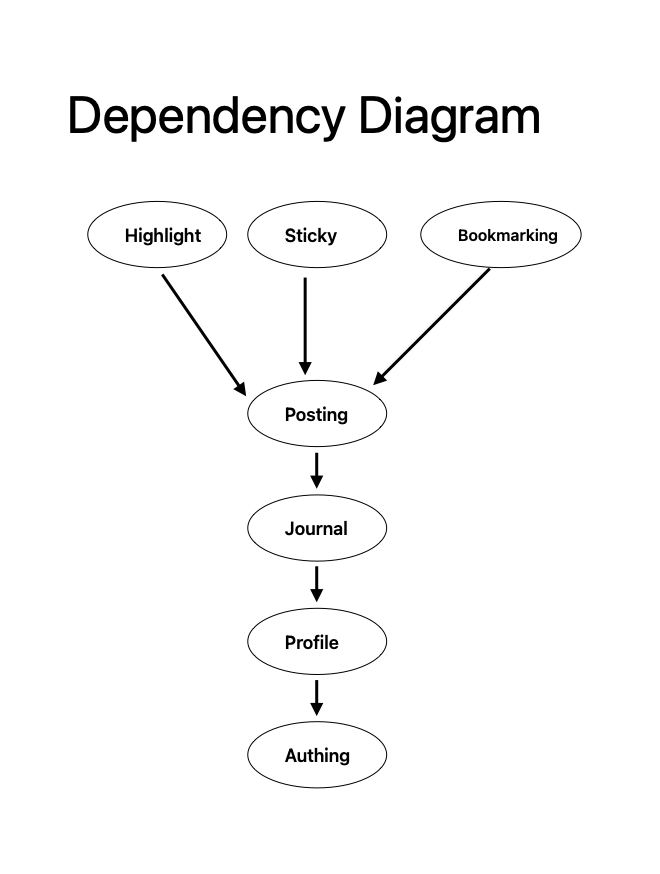
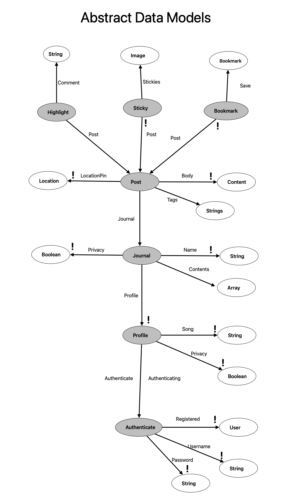

# Assignment 4

## Pitch

PocketMe is a social media platform designed for seniors who enjoy sharing personal reflections, poetry, and everyday updates in a journal or diary format with longer written pieces. The app fosters meaningful connections with close friends and family, offering a comforting space to capture memories, thoughts, and emotions without the overwhelming noise of traditional platforms.

Users can create journals that allow them to post entries with text and images, which can be either public or private. Entries are tagged by topics like family, travel, food, or hobbies, making it easy to explore similar content. A highlight feature enables readers to comment directly on specific parts of other users' entries.

PocketMe’s unique "Places" feature lets users tag the location of their entries, adding an interactive map that showcases where memories were made. With options to save favorite posts to bookmarks. This app ensures a simple yet heartfelt way for elders to stay connected with family or friends and preserve their life stories and reflections.

### Updated Dependency Diagram
{:width='400'}

###  Abstract Data Model
{:width='400'}

## Functional Design 
### Concepts
- concept Posting [User, Item]
    - purpose: media entry 
    - principle: Users can create media to share for other users to see publicly or they can keep privately just for them to access.
    - state:
        - body: entry -> Strings, Images
	    - tags: multiple Strings
	    - LocationPin: Entry -> one map location
    - actions
	    - AddPost(i: item, body: Content, tags: strings, LocationPin: location, out: entry)
	    - deletePost (i: item, body: Content, tags: strings, LocationPin: location, out: entry)
        - edit
----------------------------
- concept Highlighting [Item]
    - purpose comment on media
    - principle: Users can select a section of text from another user’s public content and can leave a comment on it 

    - state:
        - Comment: Item -> set String
    - actions
	    - createHighlight (i: item, Comment: set String, out: string)
        - updateHighlight (i: item, oldH: string, newH: string)
        - deleteHighlight (i: item)
----------------------------
- concept Stickying [Item]
    - purpose add sticker reaction on items
    - principle: Users can can leave a reaction on another user’s content publicly.
    - state:
        - Stickies: Item -> set Image
    - actions
	    - addSticky (i: item, st: sticky)	
        - removeSticky(i: item, st: sticky)

----------------------------
- concept Bookmarking [Item]
    - purpose: save content 
    - principle: Users can save other users’ public items 
    - state:
        - Save: Item -> set Bookmark
    - actions
	    - addBookmark (i: item)
        - removeBookmark(i: item)

----------------------------
- concept Journaling [Item]
    - purpose: collection of contents created
    - principle: Users can categorize contents created by them into different collections could be according to topics
        - Name: Item -> set String
        - Contents: Array
        - Privacy: set Boolean
        - Author: ObjectId
    - actions
        - deleteJournal(item: ObjectId)
        - updateJournalSettings(item: ObjectId, name: string, privacy: boolean)
        - createJournal(author: ObjectId, name: string, privacy: boolean)
        - getJournals()
        - getByAuthor(author: ObjectId)
----------------------------
- concept Profile [User]
    - purpose: collection of user’s contents
    - principle: Users can see their own profiles or others profiles where items created by them are displayed, and they can pair their profile with a song
        - Privacy: set Boolean
        - song: set String
    - actions
	    - addSong(j: string)
        - deleteSong(oldS: string, newS: string)
        
        
----------------------------
- concept Authenticating [Item]
    - purpose: collection of user’s contents
    - principle: after a user registers with a username and password pair, they can authenticate as that user by providing
        the pair: register (n, p, u), authenticate (n, p, u') {u' = u}.
    - state
        - registered: set User 
        - username, password: registered one String
    - actions
        - register (name, pass: String, out user: User)
        - authenticate (name, pass: String, out user: User)
        
        
----------------------------
- concept Session-ing [User]
    - purpose: enable authenticated actions for an extended period of time
    - principle: after a session starts (and before it ends), the getUser action returns the user identied at the start: start (u, s); getUser (s, u') {u' = u} the pair: register (n, p, u), authenticate (n, p, u') {u' = u}.
    - state
        - active: set Session
        - user: active one User
    - actions
        - start (user: User, out sess: Session)
        - getUser (sess: Session, out user: User) 
        - end (sess: Session)
        
        
----------------------------

----------------------------
