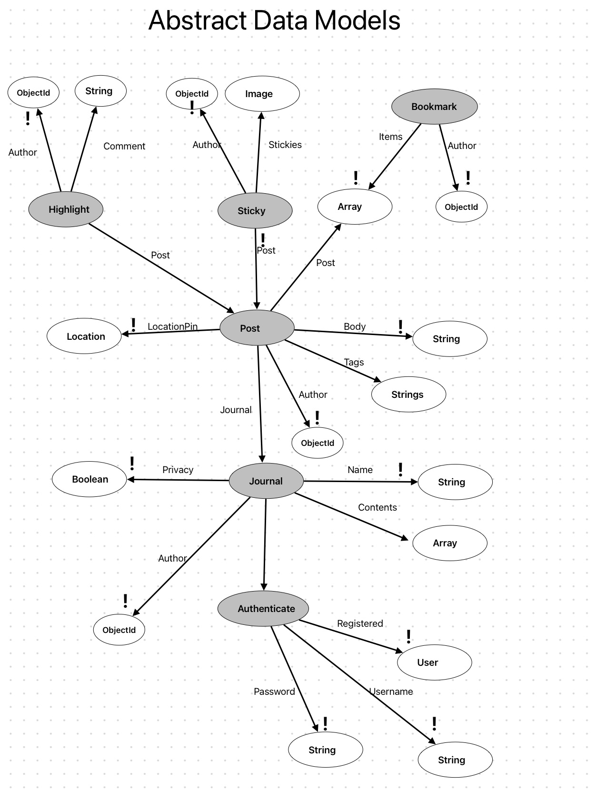

# Assignment 4

## Pitch

PocketMe is a social media platform designed for seniors who enjoy sharing personal reflections, poetry, and everyday updates in a journal or diary format with longer written pieces. The app fosters meaningful connections with close friends and family, offering a comforting space to capture memories, thoughts, and emotions without the overwhelming noise of traditional platforms.

Users can create journals that allow them to post entries with text and images, which can be either public or private. Entries are tagged by topics like family, travel, food, or hobbies, making it easy to explore similar content. A highlight feature enables readers to comment directly on specific parts of other users' entries.

PocketMe’s unique "Places" feature lets users tag the location of their entries, adding an interactive map that showcases where memories were made. With options to save favorite posts to bookmarks. This app ensures a simple yet heartfelt way for elders to stay connected with family or friends and preserve their life stories and reflections.

### Updated Dependency Diagram
{:width='400'}

###  Abstract Data Model
{:width='400'}

###  Design Reflection
During the backend implementation, several unanticipated challenges emerged, requiring adjustments 
to my original design. One issue involved users potentially skipping steps, like trying to create a 
post without first setting up a journal. To handle this, I implemented error checks to ensure certain 
actions were only allowed if prerequisite steps were completed, improving the user flow and preventing 
confusion.

A separate issue arose with the bookmark feature. I needed to ensure each user had a single bookmark 
instance, using an array property to store all bookmarked posts. This required careful checks to prevent 
multiple instances of a bookmark from being created, this was a concept slightly different from others 
because it needed to be instantiated only once per user because this would act as creating the bookmark 
folder where they would keep all posts bookmarked.

Additionally, I initially considered giving users the option to set privacy for both journals and 
individual posts. However, I realized that simplifying this to only the journal level made more sense, 
as posts are inherently nested within journals. This decision reduced the complexity for users and 
established a clearer hierarchy in the data structure.

Furthermore, I discovered gaps in my initial design, such as the need to include the author's information 
within posts, which was overlooked. Throughout the process of bulding functions I noticed new synchronizations
 that needed to be included like sessioning. I also realized that profile did not need to be a concept but it
  is rather a UI idea, because there are no actions related to it.

