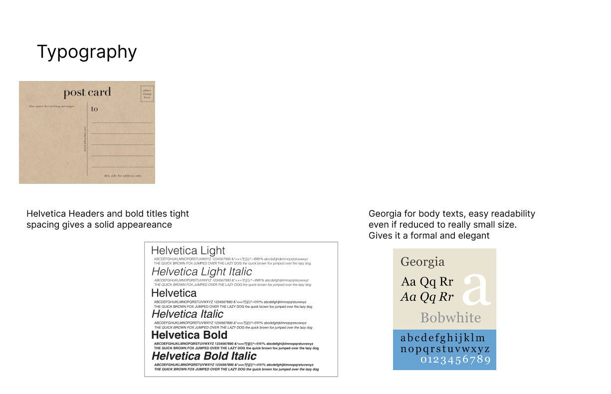

# Assignment 5

## Wireframes
[FrontEnd Repo](https://github.com/castilloadriana/frontend-pocketMe)
[Vercel Deployment](https://frontend-pocket-f5l3lnj8p-adrianas-projects-b4563a35.vercel.app/)

## Visual Design Study
{:width='500'}
{:width='500'}

## Heuristic evaluation
### Usability Criteria:
Errors:
If users select the wrong journal for a post, they should be able to update the post’s journal property easily. A simple way to indicate whether a journal is private could be by adding a lock symbol next to it, representing privacy. Additionally, users should be able to edit posts—such as fixing typos or removing sections. To ensure clarity when updating journal properties, there should be a confirmation message like “Changes saved” to prevent confusion, as users might select a journal but fail to save it correctly in some cases.

Safety:
The interface currently ensures users can choose whether their posts are private or public based on the journal selected. After creating a post, users are presented with a menu to select a journal, with the privacy settings determined by the journal’s properties. To enhance safety, a confirmation pop-up should appear when users try to exit before posting, asking them to confirm if they want to leave the screen and lose their content. This would help avoid unintentional data loss.

### Physical Heuristics:
Fitts’s Law:
The user can easily navigate the app, typically within 2-3 clicks, to switch between pages, view posts, or access journals in other profiles. Critical actions such as posting or saving are positioned in the corners of the screen, making them easy to locate and ensuring they are accessible for important tasks.

Situational Context:
Users can identify their current location within the app by looking at the bottom menu, where icons change to a bold color based on the active screen. The design also helps users navigate their profiles and journals, displaying a clear title to indicate the current journal and providing arrows for quick access back to the profile or previous pages.

### Linguistic Heuristics:
Speak the User’s Language:
The app uses simple, straightforward language, familiar to users who are accustomed to physical diaries or journals. While there may be a small learning curve due to similarities with other social media platforms, the tangible diary concept makes the transition easier. For any guardrail pop-ups you implement (such as for exiting or confirming actions), adding symbols (e.g., a warning icon for exit confirmations or a checkmark for successful updates) will make these messages clearer.

Information Scent:
The Explore page offers content suggestions through popular tags and a search option for people or topics. Users can follow tags to have relevant content appear in their feed. Additionally, trending public posts with high engagement could be displayed on the Explore page. Users can also discover new profiles by seeing others’ reactions in the comments or on posts they engage with.
