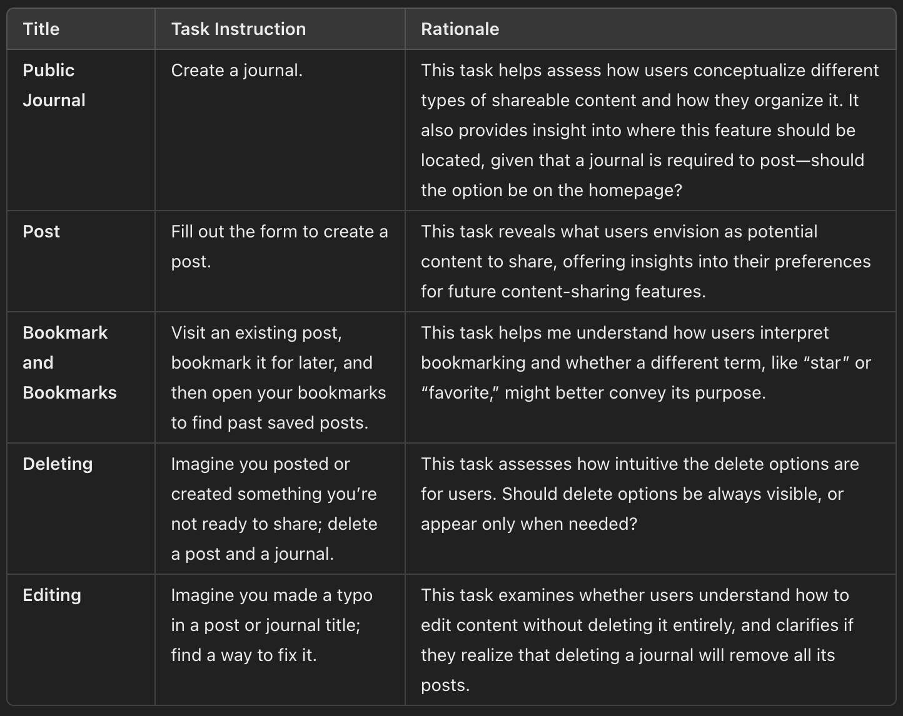

# Assignment 6

## Task List
{:width='500'}

## Study Reports
When both users first interacted with the interface on the home page, they were prompted to create a public journal. However, they instinctively began by creating a post, as this aligned with their initial expectations of the layout. I believe the further reason why they did that was that they anticipated that selecting “Other” or “Create Journal” from the drop-down journal list would initiate the journal creation, reflecting the typical behavior found in form or dropdown interactions.

One user expressed discomfort with the journal creation form being located in the profile section, as navigating there required multiple clicks, disrupting her focus on the task at hand and making her forget what her post was going to be about, she mentioned that in this case, it would also come in handy having an "autosave draft" for people that want to come back later to continue edits. Both participants also struggled to locate the profile screen because the menu options were too closely spaced, creating the impression that “Profile Settings” was a single option rather than distinct items.

Visually, the users found the mental model of journals and posts easy to grasp, appreciating the option to keep journals private. They also appreciated that the “create post” form was the primary focus on the home page, as it encouraged immediate writing and posting before exploring other content. The minimal design and simple containers were also well received, as they helped prevent the interface from feeling overwhelming.

When discussing potential features, such as the ability to highlight and comment on specific content, one user expressed enthusiasm, noting the similarity to features found in apps like Wattpad or Medium. However, both users mentioned that the lack of profile pictures and biographies made the platform feel less personal and human, as profiles lacked visual identifiers next to usernames on posts.

## Flaws or opportunities for improvement
Improvements:
* Physical, Medium: To clarify that journals in the profile contain posts, it would be helpful to include a “View Posts” option. Additionally, displaying the journal name on each post would allow viewers to easily find more content in the same journal, enhancing navigation and content discovery.
* Physical, Minimal: Allowing users to view a single post at a time when clicked would prevent screen clutter, enabling focused reading and easier engagement with comments without distractions.
* Linguistic, Minimal: To reinforce the journal hierarchy, one user suggested a visual representation resembling books on a shelf at the top of the home page. Users could select a journal to write in, and the selected journal could open like a physical book, allowing pages to be flipped—enhancing both the experience and clarity of the journal-post structure.
* Physical, Minimal: One user, a frequent Sidechat user, recommended adding a feature that allows users to view their previous comments or reactions on other posts, improving engagement and recall for frequent users.

