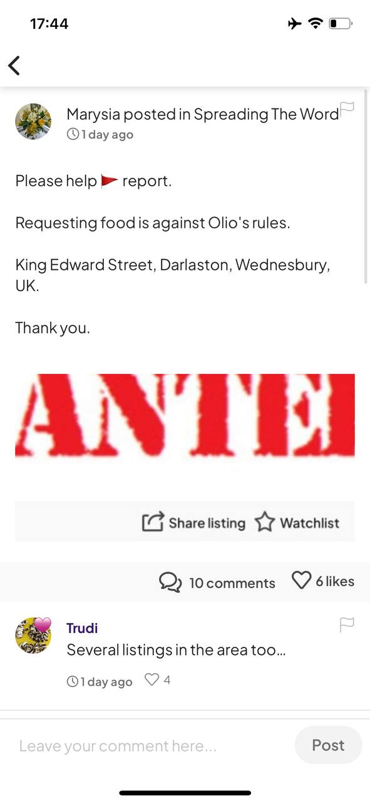
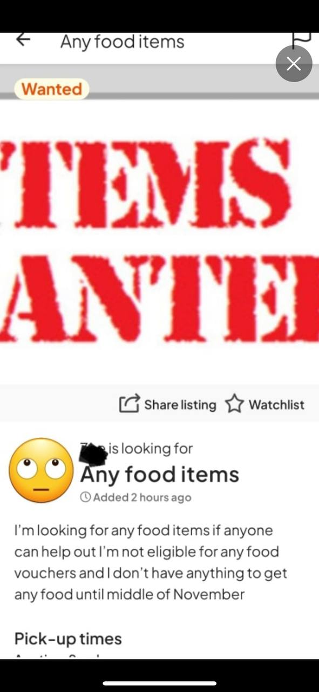
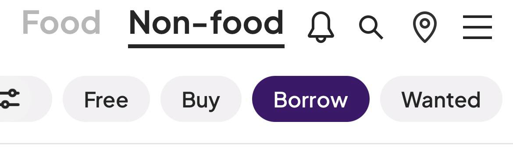
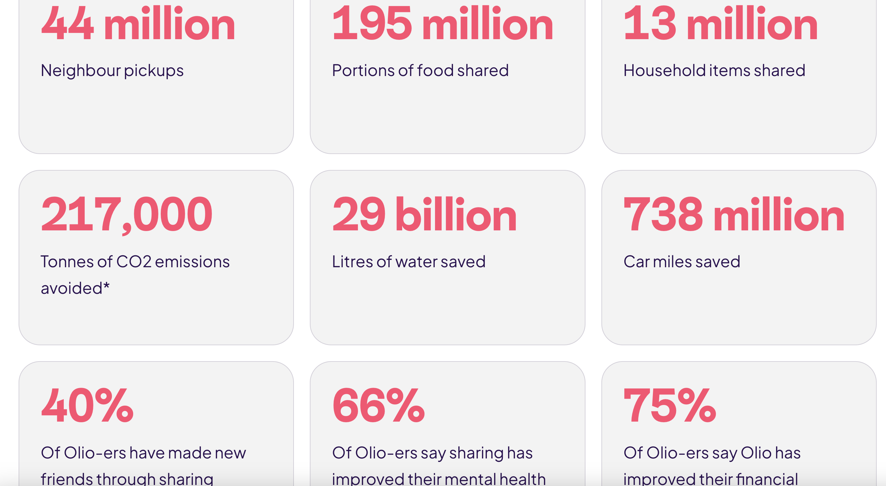
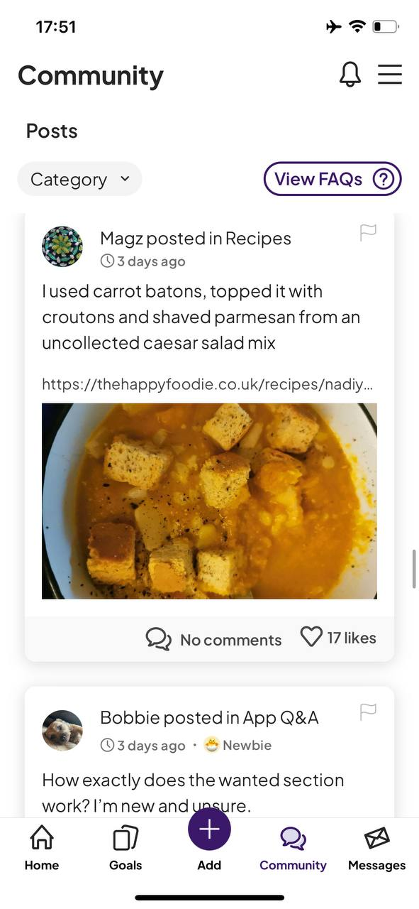
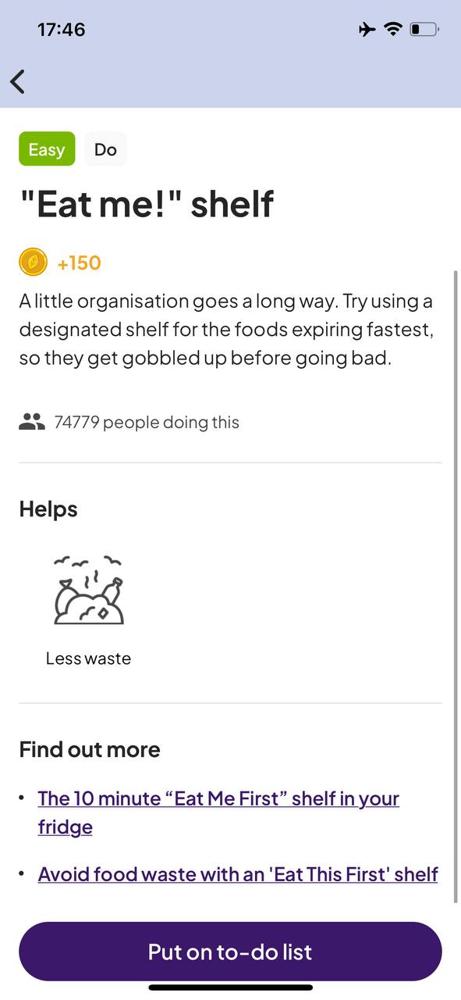
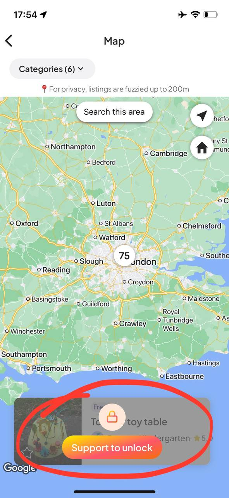
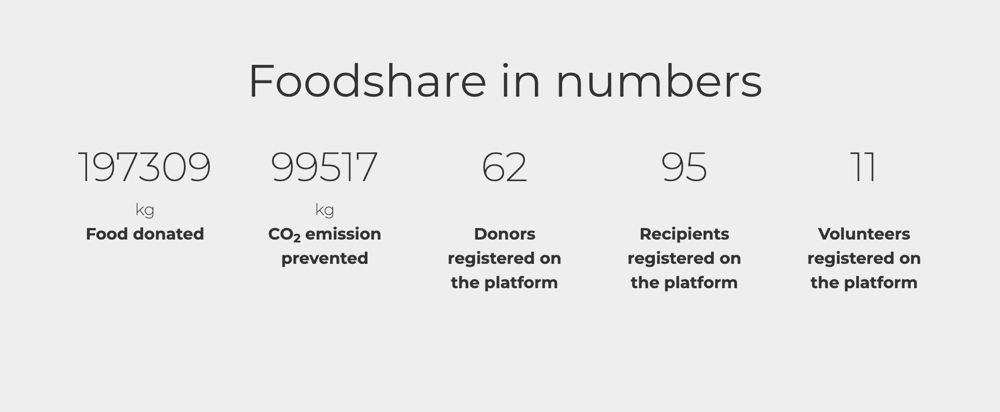
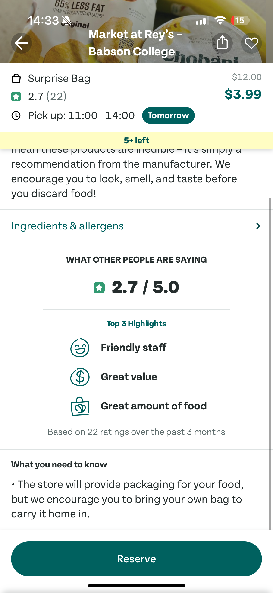

# Project Phase 1: Impact Case 
November 7, 2024. By Carla, Adriana, Arzy, Arli

## Team Contact 

### Expected Level of Achievement and Effort 
- We all agreed that we would like to aim for an A or a B, and that we’ll work to build a functional, quality app.

### Personal Goals 
- Carla: Build a high-quality app and gain team collaboration experience.
- Adriana: Improve frontend skills and backend architecture.
- Arzy: Focus on building a valuable app and learning collaboration in software development.
- Arli: Enhance frontend design and backend architecture.

### Meeting Schedule 
- Location: Zoom as default, occasionally MIT/Wellesley campus when available
- Frequency: Sundays and Wednesdays

### Maintaining Quality 
- Communicate code changes clearly and push updates thoughtfully.
- Avoid duplicate file work (two people can simultaneously work on separate files but not the same one)
- Conduct team code reviews in meetings.

### Task Assignment and Missed Deadlines 
- Brainstorming in meetings; coding done individually.
- Members volunteer for tasks based on interest with a focus on workload balance.
- Offer support if anyone falls behind.

### Decision-Making and Conflict Resolution
- Embrace open communication, constructive feedback, and honesty.
- Growth mindset

## Drafted Impact Case 

1. The problem of overconsumption is important because when some people purchase too much food and can’t use it in time, it often goes to waste. This results in increased demand for food and therefore increased carbon emissions. On the other hand, while some struggle with excess, others struggle with food insecurity, meaning that food is not distributed evenly enough to meet everyone’s needs.

2. Our solution is an app where people can easily share food. On a small scale, we want to bridge the gap between users who are looking for foods and producers and other users who have leftover foods that they want to give away. Users will be able to rate their exchange and experiences with other users ensuring a quality experience, and in a more severe case ensure that the food/produce is fresh and safe. This way, individuals can see the experiences of different exchanges ensuring the safety, and incentivizing people to participate in food exchanges. 

3. This app would be a great way to redistribute food from those who don’t need it to those who do. A mobile app is easily accessible by all users in just a few clicks away as opposed to having to knock on all neighbors’ doors or look for other ways to get rid of the wood. At the same time, people who need these products can easily access them without having to call their neighbors.

4. We could measure the number of active users and the number of foods exchanged to prove that our food sharing app is a good solution to reduce food waste, since each item given away to someone who will consume it is an item that doesn’t go in the trash. 

## List of Interview Roles and Potential Interviewees 

### Experts

Fresh Produce Specialist:
- Lisa A farmer based in Quetzaltenango, Guatemala, who grows a variety of vegetables and fruits. She markets some of her produce while keeping a portion for personal use.

Environmental Studies Specialist:
- Sarah A student majoring in Environmental Studies at Wellesley College. She is an environmental planner inter as well as a sustainability and environmental advocate.

### Users 

Adult Living in a Family Household:
- Sveta – A 55-year-old housewife from rural Ukraine. She lives with her husband, while her children are away at college, and prepares most of their meals at home.

Young College Student in Independent Housing:
- Michael – An MIT student living in a cook-yourself dormitory, also serving as the president of the cooking club.

## Research Findings 

### Existing solutions to food waste:
- Some communities have food banks that people can donate food to. However, not every city will have one, and it is also common for food banks to have restrictions on the kinds of foods that can be donated. For example, some food banks may not accept perishable foods, leaving community members little choice but to throw out perishables that they do not use. 

### Existing Apps: 

#### Olio: 
- Food / household item sharing/selling app for individuals and businesses 
- encourages a circular, sharing-based economy and helps people save money while reducing waste
- Cannot request food - lost opportunity because oftentimes users might have something in bulk to share like flour or sugar but users won’t post this 

{:width='200'} 
{:width='200'}

- Different sharing options: free, buy, borrow, wanted. Good to have multiple options!

{:width='200'}

- Pick up location is determined by users
    - This might cause secuity issues 
    - Can we have a dedicated location where item exchange happens? But this also complicated things as it requires hanlding costs

Here is how they measure success:

{:width='100'}

Interesting concept: 
 - community: people posts general questions and help each other out, share pics of foods they made using the products they got from the app; almost like a built in forum

{:width='200'}

Point system - is that enough of an incentive?
{:width='200'}

Weird paywall to see listings - why?
{:width='200'}

#### FoodShare
- food redistribution platform that helps connect surplus food from donors, like farmers and retailers, with community organizations that support people facing food insecurity
- part of the EU-funded Ploutos project, currently operates in Serbia and North Macedonia
- Not an app, but rather NGO with full time volunteers / staff

Impact: 
{:width='400'}

#### Too Good To Go 
- Food app that allows restaurants and other buisnesses to post left over foods at the end of the day 
- One of the gaps I noticed in this application is the inability for the user to see the ratings of a given “suprise” bag that is assumed to be filled with produce. However, if a person decides to click on the ingredients or allergen they cannot see the specific produce or items it contains. This poses as a problem to users since they have to assume what type of foods are within the bag, and makes it a lot harder to meet their needs. 
- Another gap I noticed is the lack of accessible user reviews. While the app shows an overall rating of 2.7, which naturally makes users curious about the reasons behind the low score, there’s no way to view specific feedback from others. This omission prevents users from understanding common issues or experiences and is a significant missing feature.

{:width='200'}

## VSD Analysis 

#### Non-targeted Use. 
- One type of user that might be considered nefarious is someone who claims all of the free food on the app, leaving little to none for other community members. Although we don’t want to prevent people from getting what they need, allowing one person to claim everything will prevent other people from having their needs met, and will likely lead to the nefarious user wasting food themselves.
Another nefarious user might list food that has gone bad or has otherwise been tampered with. An unknowing user might claim this food and become sick as a result. It is also possible for a user to be unaware that the food that they list has expired.

#### Sustained Friendships
- People actively using the app will discover other users who probably share similar interests and values (e.g. environmental sustainability, thrifting, cooking, etc). Because of the geographic proximity of users engaging in food sharing, these friendships can be taken elsewhere. However, there needs to be a way to connect people in the app as well.

#### Indirect stakeholders
-  When people are missing a single ingredient, they tend to run to a corner store or order delivery. If the app scales up and that needs is met internally, these third parties can lose their demand. However, we cannot possibly have everything in households, and these business are used for other general purposes like regular grocery shopping, which our app does not aim nor is able to replace. Plus, these businesses can be ultimately turned into app users.

#### Diverse Geographies
- Cities: People with extra meals, extra food from events/restaurants can participate.
Remote/ country side: It could allow farmers to share their surplus or products with more people

## Interview Plans and Summaries of Key Lessons 

#### Introduction:
-  Ask participants to share their background. Talk about resources they rely on for food and how satisfied they are with them. 

#### For Experts: 
- Discuss the primary issues with food surplus and insecurity, how communities address them, what works and what doesn’t. For Lisa, focus on fresh produce management farmers utilize, and for Sarah, talk about solutions on college campuses. Gauge interest in an app that connects local producers with buyers.

#### For Users: 
- Focus on challenges they face in accessing affordable, nutritious food, their experience with food sharing in their community, and their attitudes toward an app for improving food access.

#### Closing: 
- If you had a magic wand that could help you achieve your goals most effectively, what would it be?

#### Key Findings: 

The four interviews we conducted reaffirmed the need for a food-sharing app. All of our interviewees shared that they have experienced the effects of the unequal distribution of food before– whether it was having too much food or not having enough. They each had informal systems for sharing food with friends, family, or neighbors. For example, Sarah is part of a campus organization called SCOOP that redistributes leftover food. Michael’s community has a counter where residents can place non-perishable ingredients to share. Sveta is part of a village group chat with 1000+ members, where people often post about food and produce that they are selling. However, these systems aren’t perfect. Sarah has found that her options are limited even with her network, in part because she has dietary restrictions. Michael complained that fresh produce is rarely shared. Sveta feels that it is hard to find old listings, as they are quickly buried under new messages.
In spite of being involved in food-sharing systems, some of our interviewees expressed that it can be difficult to connect people who have a surplus of food to those who have a deficit, especially because in most cases, these informal communities are not very big. Lisa shared that it is difficult for small food producers to maintain a stable market through their associations. Although it would be ideal to have a place where these connections can be fostered, some have their reservations about it. Sveta and Michael both mentioned that they would hesitate to accept food from a complete stranger, and some are uncomfortable with asking for food because of the stigma surrounding food security.
After the interviews, we identified several opportunities to create value in our app. Some features that we would consider implementing are allergy tags to make the app inclusive of those with dietary restrictions, and monetary transactions for small producers to sell their food. We would also like to find ways to destigmatize asking for help as much as possible, create community, and foster friendships. In order to create a sense of trust, we’d like to include a rating system.

## Revised Impact Case

1. When some people purchase too much food and can’t use it in time, it often goes to waste. This results in increased demand for food and therefore increased carbon emissions. On the other hand, while some struggle with excess, others struggle with food insecurity, meaning that food is not distributed evenly enough to meet everyone’s needs. An important issue of food access is the lack of time to travel to a particular grocery store or prepare meals. One of our college student interviewees highlighted that he did not “have the time or energy to walk 30 minutes to get to the closest supermarket”. Indeed, food sharing is often a common practice in family circles as noted by Sveta and Sarah, but to solve food insecurity, it needs to be scaled to create a greater impact and destigmatize receiving food aid. While there are many working solutions in place to redistribute food, they are often supervised by third parties and miss out on the opportunity to create a food-sharing culture within the community.

2. Our solution is a food-sharing app that addresses user pain points, successfully bridging the gap between those who are looking for food and those who have food they want to give away. We plan to implement money transactions, exchange rating and reporting systems to limit abusive use patterns, ensuring safety and incentivizing people to participate in food exchanges. 

3. This app would be a convenient and streamlined way to redistribute food from those who don’t need it to those who do. It is also adaptable to diverse geographies. For example, in cities, people can give away unused ingredients and meals, while in rural areas, small farmers can use the app to sell unfit produce to the local community for lower prices as Lisa said. Another reason that this app is a great solution is that it caters to a diverse set of users. Home cooks who live alone and cannot consume food quickly enough like Michael, people with dietary restrictions like Sarah, farmers who cannot sell all of their produce like Lisa, and housewives who are part of large communities like Sveta can all benefit from this, as our interviewees expressed. This app also has the positive side effect of fostering friendships between people who might have similar interests, such as backyard gardeners. 

4. We could measure the number of active users, the number of foods, and the satisfaction of the users during their food exchanges to prove that our food-sharing app is a good solution to reduce food waste since each item is given away to someone who will consume it is an item that doesn’t go in the trash. On the Too Good to Go app, users can rate the foods they receive from the restaurants listed. However, one gap that we noticed was the inability to view the specific feedback from others. This prevents users from understanding common issues in these exchanges, which is why our app also lists the satisfaction rates of users. As Foodshare does on their website, we could also translate the number of meals exchanged to amount of carbon emissions saved.

