# Project Phase 2: Divergent Design
November 11, 2024. By Carla, Adriana, Arzy, Arli

## Broad Application Goals
Our app, **RePlate**, is designed to **empower sustainability-minded individuals** and **those experiencing food insecurity** by directly connecting people with surplus food to those in need. Unlike similar platforms, our app eliminates third-party involvement, allowing users to engage in **direct exchanges**. We believe this approach will nurture a **culture of food-sharing**, build stronger community ties, and inspire people to support one another in meaningful, lasting ways.

## Scrapbook of comparables

### Too Good To Go
This design shows the user the amount of money they saved and the amount of Co2 emissions they saved by purchasing foods that are left over at the end of the day that prevented even more food waste. This could be useful to provide users with a informational perspective of how their actions make a difference, serves as an incentive. 
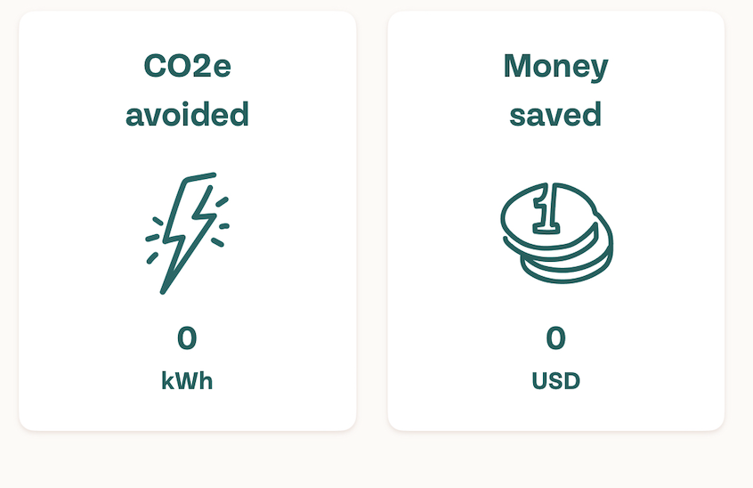{:width='400'}

### Uber Eats
Very pleasing and convinient filtering - no need to type, what you are looking for is one click away, more options for a more selective search
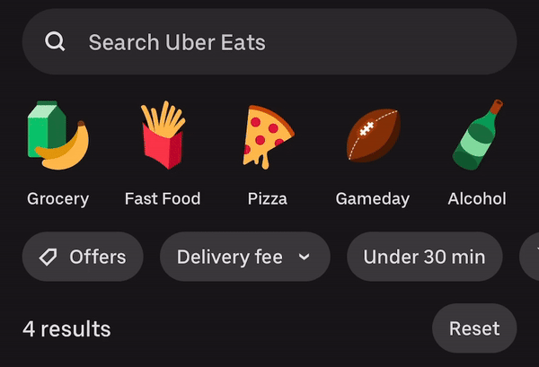{:width='400'}

Time estimation - very useful for busy people who are debating between ordering a single ingredient from a grocery store or asking neighbors
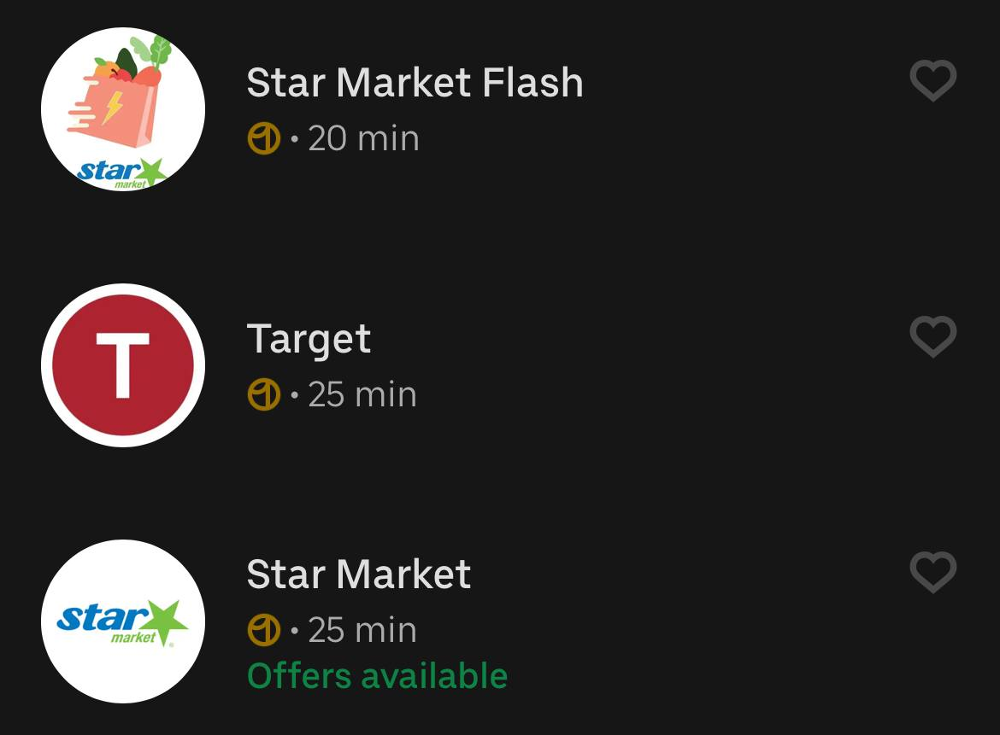{:width='400'}

Reviewing system is direct and to the point. Important and could be used similarly for users to review the items when they receive them to ensure both its quality and safety. 
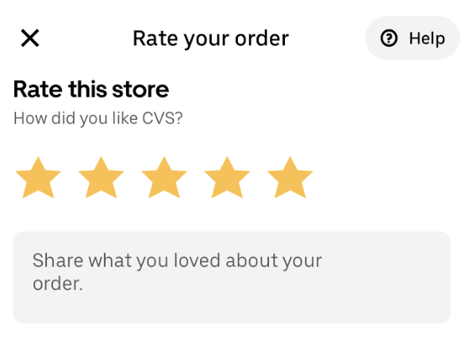{:width='200'}

### Instacart
Shows the product information as a drop down under details and provides a slide of the nutrional facts that display the ingredients - useful as a potential way to display information if users plan to exchange prepared foods
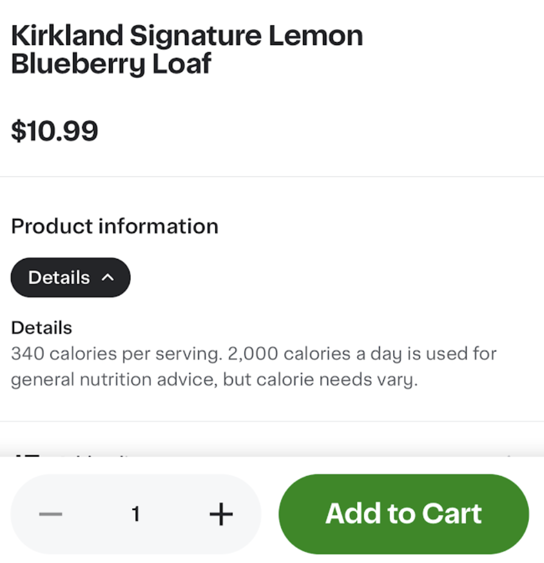{:width='400'}

### Depop

By clicking on a user, others can see how long the seller takes to ship - maybe we can have similar stats with the response time?
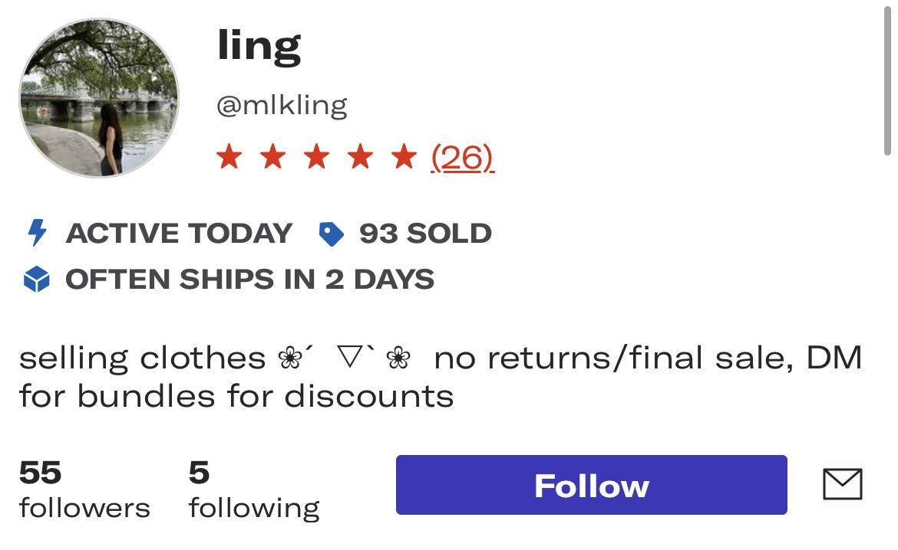{:width='400'}

Profile page also allows see posts of one specific user. Tt makes it easier to buy from one seller and one can save on shipping. In the context of our app, if the user is looking for several items, it would be easier to make one trip to one person than get the items from different places.
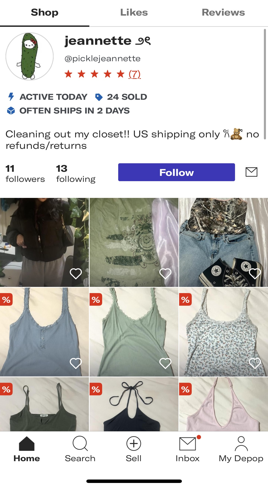{:width='200'}

Instructions on how to make photos and examples will be super helpful for users to make their postings more appealing.
{:width='200'}

### Facebook Marketplace

Map view is nicely implemented: users can customize the local radius and only listings within that distance will be displayed
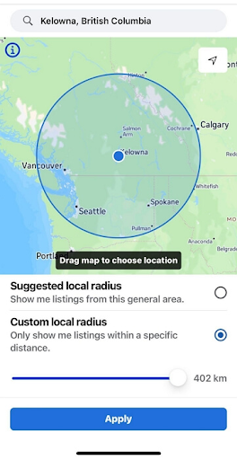{:width='200'}

### Olio

A similar feature is present in Olio, but it also groups items by location
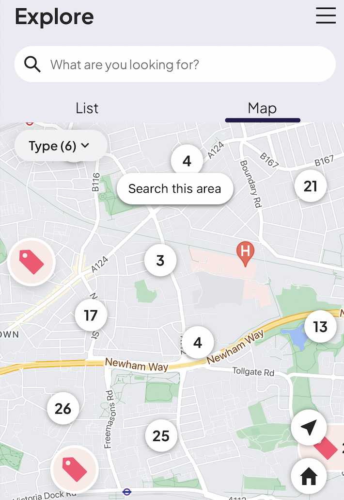{:width='200'}

Communities are a good way to nurture long-term friendships, but it should not be predefined like in Olio where users can't create new ones and must apply to join existing communities.
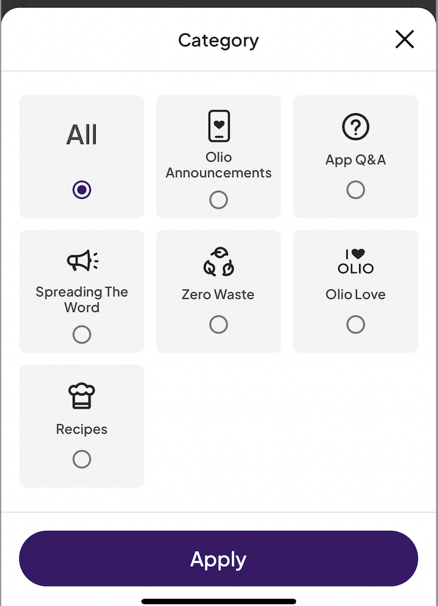{:width='200'}

### eBay
Saved searches allow users to mark postings they want to come back to, and we can also use it to find out when foods the user regularly claims are being posted.
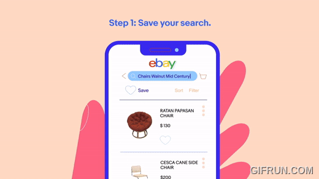{:width='400'}

### Duolingo
Leaderboard is a way to to highlight user achievement and encourage them to keep going. We can implement a similar concept in the shape of badges or something like that.
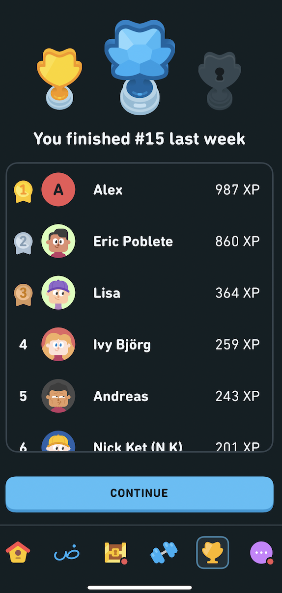{:width='200'} 

## Brainstorming features
1\. **Locator**: a map that helps view within a certain range where each food listing is. This can allow the user to select a maximum number of miles they are willing to commute for food. 

2\. **Rating**: After a user completes a purchase they can fill out a rating form where they can rate the quality of the food, and the communication with the user posting. This can be comprised of number scaling and an optional short-worded feedback section.

3\. **Recipe suggestions**: if the posting user is offering a big stock of a certain item they can add some suggestions of what people can cook with the items, this could also be powered with AI suggestions. For instance, the user could be posting their farm carrot surplus so they could give examples like carrot cake, carrot soup, pasta sauce, etc.

4\. **Allergy tags**: Users who post food, especially prepared foods, can tag them with common allergens or dietary restrictions so that other users can see them.

5\. **Expiration dates**: Each post will contain an expiration date for the food if it is perishable. I think it’d also be helpful if feeds are sorted by expiration dates by default to ensure that things that will expire soon are seen by the most people, which would maximize waste prevention.

6\. **Food type tags**: Each post can have a tag or multiple tags describing the type of food it is– prepared meals or ingredient. That way the app can be helpful for more types of users (i.e. a home cook missing a protein for their dinner might be looking for an ingredient, while someone who doesn’t have the resources to cook might be looking for a prepared meal).

7\. **Point system and levels**: Users are awarded a certain number of points for posting or claiming food (probably more for posting than claiming) to incentivize them to use the app. They can level up by earning points, which also indicates to other users that they are trustworthy.

8\. **Saved searches**: Users can save searches for items they regularly claim and be notified when those items are listed. For example, someone who loves oranges and lives in an area where lots of people have orange trees would find it useful to save that search.

9\. **Food safety tips**: The app can provide users with tips about identifying when food is safe to give away and to claim, and about how to safely handle and store food that will be given away.

10\. **Auto-delete listings**: Inevitably, some food will not get claimed, so after a certain amount of time (likely depending on what kind of food it is), the listing will be deleted so someone doesn’t claim rotting food.

11\. **User profile questions**: Users are asked optional questions, and the answers will be displayed on their profiles. Some of these will be more important (i.e. food allergies and dietary restrictions) while others will be fun and intended to help users get to know their community (i.e. favorite restaurant, favorite food/fruit/vegetable).

12\. **Allergy guard**: If a user with a certain allergy or dietary restriction on their profile attempts to claim an item tagged with that allergy or dietary restriction, the app will warn them of that, just in case they overlooked it.

13\. **Order History**: Users can view their past orders and who they purchased from. They can track their spending and shopping trends.  

14\. **Bookmarking**: Users can save listings that they are interested in and come back to them later if they do not know for sure if they want to claim it right away.

15\. **Requests**: If a user is looking for a specific item, they can post a request for it. They can also include a timeframe that they would need it by. The request disappears from feeds if it is not met by the time that timeframe is up. Requests are displayed on a request board.

16\. **Community resources**: The app can plot local food-related resource centers like food banks and soup kitchens on a map, just in case a user can’t find what they need from other users’ posts.

17\. **Carbon footprint report**: For individual users and for the app as a whole, we can display the amount of CO2 emissions saved to incentivize people to continue to use the app.

18\. **Average response times**: On a post listing, display the poster’s average response time so that the claiming user knows how long they can expect to wait to hear back.

19\. **Pickup spot recommendations**: Based on where the poster and the claiming user are, recommends a safe/popular pickup spot nearby (optional, can just be settled by the users involved)

20\. **Reporting**: Users can report other users for things like posting food that has been tampered with. If a user is reported by several other users, they will only be able to accept food.

21\. **Notification suggestions**: Based on their past purchases they can get suggestions of products or users that might be of their interest, these can be in the form of notifications. 

22\. **Private posting:** maybe users can create smaller communities and post their food there privately? Or an option to post an item only for friends.

23\. **Grouping food:** we can group items that were not claimed immediately if they work together as ingredients for a recipe. For example, if there is a can of tomatoes, basil leaves, pasta, we can suggest these items together to users.

24\. **Poster preferences**: Sellers can specify pick up or drop off.

25\. **Chatting**: In-app messaging is available so that posters and claiming users can organize a pickup time/place.

26\. **Meal Sharing** \- users interested in joining groups or cooking with one another 

27\.  **Grouping by Category:** Scrolling food types horizontally for groups of produce, dairy and other types of foods to help users find items more efficiently 

28\. **Interest forms**: People can post something they are going to cook in the future and before deciding how much to make, they want to see if anyone is interested in getting some

29\. **Leadership board:** some sort of badge/point system for different achievements in the app so other users can see the ranking

30\. **Profiling** – All of a user’s posts will be displayed on their profile for easy browsing by other users.

32\. **Bundling**: When a user claims an item posted by another user, that user’s other items will be suggested to them so that they can be picked up together.